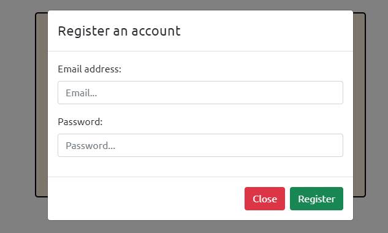
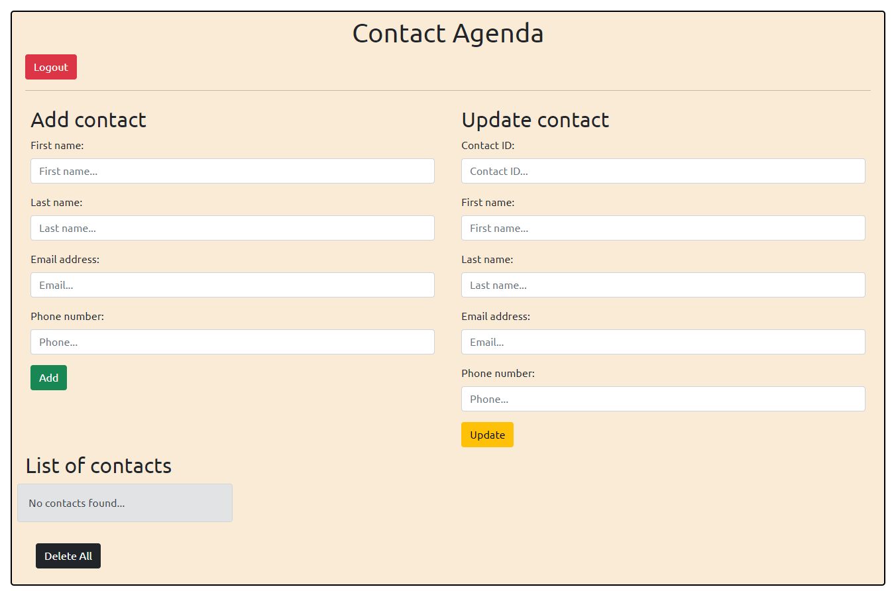
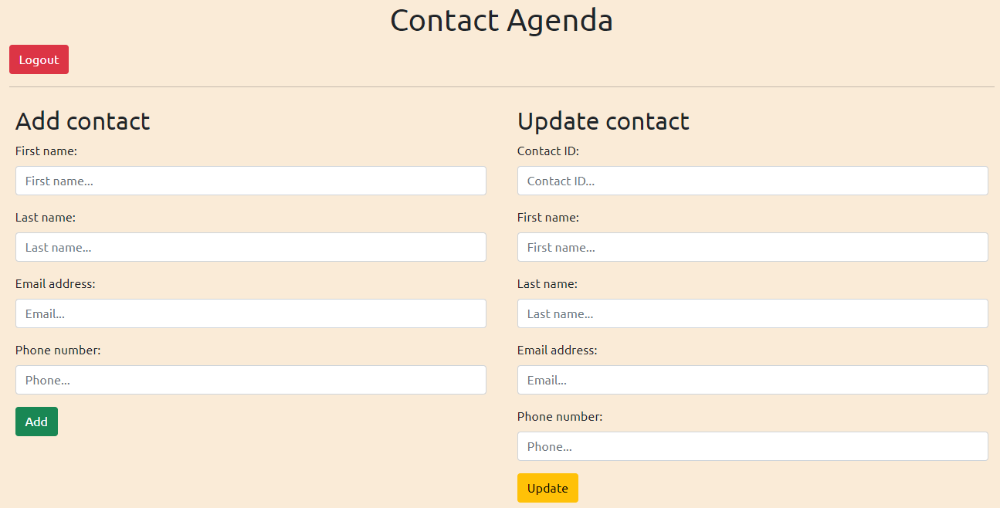
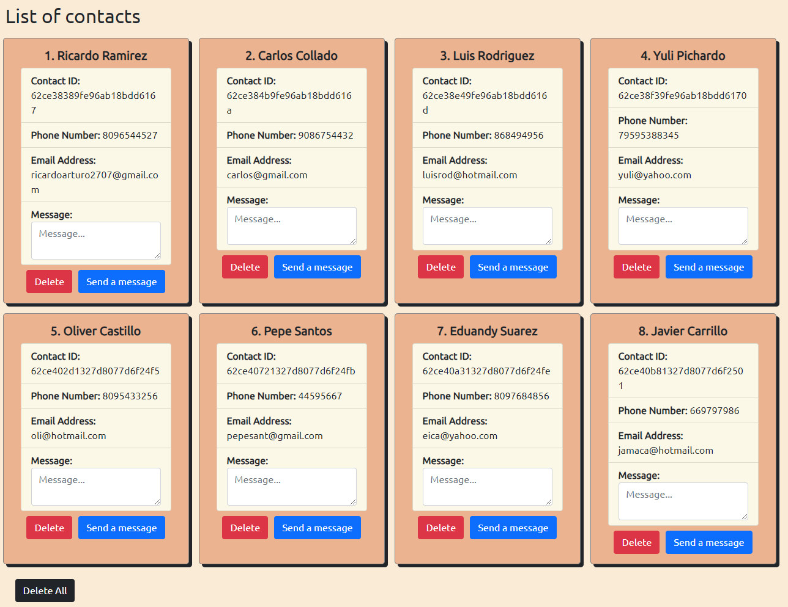

# Contact list client

## Sobre el SPA

Este SPA fue creada para consumir un [API](https://github.com/Ricaidito/contact-list-api) con capacidades para manejar una agenda de contactos y usuarios.

Las tecnologías y dependencias utilizadas fueron:

- React
- Axios
- Bootstrap
- React Bootstrap

## Como ejecutar el SPA

Para ejecutar el servidor basta con abrir una terminal en la raíz del proyecto y ejecutar el siguiente comando para instalar las dependencias.

`npm install`

Una vez descargadas las dependencias asegúrese de tener el correspondiente archivo `.env` con las variables de entorno para la conexión a la API.

Por último ejecute el siguiente comando para iniciar el cliente.

`npm start`

El cliente se ejecuta en `http://localhost:3000/`

## Como probar las funcionalidades

Las credenciales expuestas para probar la funcionalidad del mismo son las siguientes:

```
email: admin
password: admin
```

## Preview

### Login




### Agenda




